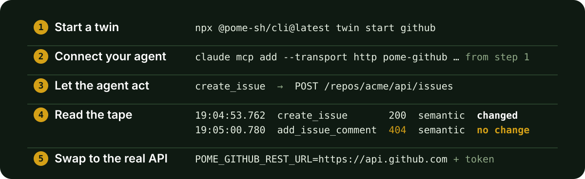

<div align="center">


# Pome Digital Twins

**Test mode for your integrations, built for the way agents build.**

[](https://github.com/pome-sh/digital-twins/actions/workflows/ci.yml)
[](https://www.npmjs.com/package/@pome-sh/cli)
[](https://nodejs.org/)
[](./LICENSE)

[Documentation](https://docs.pome.sh) · [Pome](https://pome.sh) · [CLI reference](./cli/README.md)

</div>

Pome gives you local, stateful twins of GitHub, Slack, Stripe, Gmail and Linear. Your agent, or your own code, calls a twin the way it calls the real API, over REST or MCP. There is no test account, no OAuth app and no API key.

Every request lands on a tape: the twin's own record of every call and what it changed. A step the agent only claimed appears on the tape as a step that did not happen. Stripe has a test mode. GitHub and Slack do not, and none of them hands you the tape.

<p align="center">
  
</p>

## One command

You need Node.js 24 or newer. The twins run on Node's built-in SQLite.

```bash
npx @pome-sh/cli@latest twin start github
```

It prints:

```text
Pome github twin listening at http://127.0.0.1:3333/s/standalone
POME_GITHUB_REST_URL=http://127.0.0.1:3333/s/standalone
POME_GITHUB_MCP_URL=http://127.0.0.1:3333/s/standalone/mcp
POME_AUTH_TOKEN=eyJ…

Claude Code:
  claude mcp add --transport http pome-github \
    http://127.0.0.1:3333/s/standalone/mcp \
    --header "Authorization: Bearer eyJ…"
```

<details>
<summary>The rest of the connect block — Codex, <code>.mcp.json</code>, your own code</summary>

Codex, `.mcp.json` and the SDK line read the token from your shell. Export it once:

```bash
export POME_GITHUB_REST_URL=http://127.0.0.1:3333/s/standalone \
       POME_GITHUB_MCP_URL=http://127.0.0.1:3333/s/standalone/mcp \
       POME_AUTH_TOKEN=eyJ…
```

Codex, appended to `~/.codex/config.toml`:

```toml
[mcp_servers.pome-github]
url = "http://127.0.0.1:3333/s/standalone/mcp"
bearer_token_env_var = "POME_AUTH_TOKEN"
```

`.mcp.json`, project scope, in the repo. Claude Code expands `${POME_AUTH_TOKEN}`, so the file you commit carries no token:

```json
{
  "mcpServers": {
    "pome-github": {
      "type": "http",
      "url": "http://127.0.0.1:3333/s/standalone/mcp",
      "headers": { "Authorization": "Bearer ${POME_AUTH_TOKEN}" }
    }
  }
}
```

Your own code, through GitHub's SDK (Octokit):

```js
new Octokit({
  baseUrl: process.env.POME_GITHUB_REST_URL,
  auth: process.env.POME_AUTH_TOKEN,
})
```

</details>

The twin mints the token when it starts. It is not an account credential. The twin starts with one repository, `acme/api`, and one open issue, so your agent has something to act on before you write a seed.

State lives in the twin's process and is gone when you stop it. `--seed` decides where it starts.

Several twins at once is one command: `twin start github slack linear`. Each twin takes its own port, and one connect block covers all of them.

<details>
<summary>Ports, paths, and the file the twin writes</summary>

- The twin listens on port 3333. `--port` picks another.
- It serves everything under `/s/standalone`, the one session a standalone twin has.
- It writes its address and token to `.pome/twin-status.json` in the folder you ran it from, readable only by you. `.pome/` git-ignores itself.
- Started with several twins, that file lists them under `twins`, and its top-level fields describe the twin you started last.

</details>

## Connect your agent

Paste the block for your client, exactly as printed. Claude Code takes the one-liner. Codex takes the table. Any client that reads `.mcp.json` takes the stanza, and the stanza reads the token from your shell, so run the printed `export` line first.

Your own code takes the SDK line. GitHub's Octokit, Slack's `WebClient`, Stripe's client, googleapis for Gmail and Linear's SDK each get their own. The [connect guide](https://docs.pome.sh/docs/mcp/connect) covers Cursor and the other clients.

If your client already has a real GitHub MCP server, the twin registers under its own name, `pome-github`. Disable the real one while you test. Otherwise the agent picks whichever it likes.

Then ask the agent for something small: "Open an issue in acme/api for the login page returning 500 after the deploy."

## See what it actually did

```bash
npx @pome-sh/cli@latest twin tape --diff
```

```text
github twin at http://127.0.0.1:3333/s/standalone — 3 requests

TIME          REQUEST            STATUS  FIDELITY  STATE
19:04:49.743  list_issues        200     semantic  read
19:04:53.762  create_issue       200     semantic  changed
19:05:00.780  add_issue_comment  404     semantic  no change  ← did not land

3 requests: 1 changed state · 1 write did not land · 1 read

State diff since boot (seed → now):
  repositories                   ~1 changed: acme/api
  repositories[acme/api].issues  +1 added: #2
```

One line per request, REST or MCP. A call through Octokit shows as `POST /repos/acme/api/issues`. In the STATE column, `changed` means the write landed in the twin's state, and `no change` on a write is a step that did not happen.

Here the agent listed the issues, created #2, then commented on issue #17, which does not exist, so the twin answered `404`. An agent that reports "commented" after that is what the tape is for.

The diff is what the run left behind, measured against the state the twin booted with. `--json` prints the same as one object.

If the tape showed you a step that did not happen, star the repo. That is how the next person finds it.

## Run it in CI

The same command works in a GitHub Actions job. The job below starts the twin, waits for it, hands its address and token to your tests, and prints the tape at the end. Pin the version you tested. The CLI is pre-1.0 and `@latest` moves.

```yaml
- uses: actions/setup-node@v4
  with:
    node-version: 24
- name: Start the GitHub twin
  run: |
    npx @pome-sh/cli@0.45.1 twin start github > twin.log 2>&1 &
    for _ in $(seq 60); do
      curl -fsS http://127.0.0.1:3333/healthz >/dev/null && break
      sleep 1
    done
    status=.pome/twin-status.json
    echo "POME_GITHUB_REST_URL=$(jq -r .rest_url $status)" >> "$GITHUB_ENV"
    echo "POME_GITHUB_MCP_URL=$(jq -r .mcp_url $status)" >> "$GITHUB_ENV"
    echo "POME_AUTH_TOKEN=$(jq -r .auth_token $status)" >> "$GITHUB_ENV"
- run: npm test
- name: What the tests did
  if: always()
  run: npx @pome-sh/cli@0.45.1 twin tape --diff
```

The twin from the first step keeps running for the rest of the job, and `twin tape` finds it through `.pome/twin-status.json`. This repository's own CI starts its twins the same way.

There is no account and no secret in the repository: the twin mints the token on the runner, and the token dies with the twin. Your tests read `POME_GITHUB_REST_URL` and `POME_AUTH_TOKEN` the way they would read a real base URL and token.

## Supported twins

Pome includes 5 digital twins and 115 MCP tools. Each twin publishes a route-by-route fidelity record. Every day Pome replays the same requests against the real vendor API, with its own accounts, and publishes the result per route at [status.pome.sh](https://status.pome.sh).

| Twin | MCP tools | Main API coverage | Details |
| --- | ---: | --- | --- |
| [GitHub](./packages/twin-github/) | 36 | Repositories, issues, pull requests, reviews, and merges | [Fidelity](./packages/twin-github/FIDELITY.md) |
| [Stripe](./packages/twin-stripe/) | 26 | PaymentIntents, refunds, charges, balances, events, and x402 payments | [Fidelity](./packages/twin-stripe/FIDELITY.md) |
| [Slack](./packages/twin-slack/) | 18 | Channels, messages, threads, reactions, and search | [Fidelity](./packages/twin-slack/FIDELITY.md) |
| [Gmail](./packages/twin-gmail/) | 13 | Messages, drafts, threads, labels, and uploads | [Fidelity](./packages/twin-gmail/FIDELITY.md) |
| [Linear](./packages/twin-linear/) | 22 | GraphQL, OAuth with PKCE, and webhook registration | [Fidelity](./packages/twin-linear/FIDELITY.md) |

Each route has one of these fidelity levels:

- `semantic`: The route implements and tests provider behavior.
- `shape`: The response has the provider's shape.
- `unsupported`: The twin returns `501`.

The twins answer requests. They do not call your app, and no twin delivers webhooks today. Stripe's twin exposes `/v1/events` to poll, and Linear's twin records webhook registrations without delivering them.

A flow that starts from a vendor event needs you to post that event to your app yourself.

## Swap to the real API

Three things change, and nothing else in your code should:

1. The base URL. `POME_GITHUB_REST_URL` becomes `https://api.github.com`. The MCP URL becomes the vendor's own MCP server, or yours.
2. The credential. The twin's bearer becomes a real token with real scopes.
3. Vendor-side setup the twin never asked for: OAuth apps, app installation, webhook registration. Gmail needs a Google OAuth client. The twin does not.

A green run on a twin says your integration behaves against the API as far as the fidelity record covers it. It does not say the vendor will behave the same tomorrow. Run one smoke test against the real API after the swap.

## Why not mocks, why not Emulate

| | Hand-written mocks | [Vercel Emulate](https://github.com/vercel-labs/emulate) | Pome twins |
| --- | --- | --- | --- |
| State that persists across calls | Whatever you wrote by hand | Yes | Yes |
| A tape of every request your code made | Only if you wrote one | No | Yes |
| Fidelity measured against the vendor and published | No | No | Yes, daily |
| MCP surface for agents | No | No | Yes, 115 tools |

The Emulate column comes from its README as of 2026-09-16. Emulate targets application code in a dev loop, and it is Apache-2.0 like this repo.

## Going further

`pome` below is the same CLI. `npm install -g @pome-sh/cli` puts it on your PATH, or keep using `npx @pome-sh/cli@latest`.

Everything above runs locally with no account. Hosted grading is optional. Nothing leaves your machine unless you use it, apart from the daily usage event (see [Telemetry](#telemetry)).

- Your own world: `pome twin new-seed github --out seed.json`, edit it, then `pome twin start github --seed seed.json`. Several twins from one file: `pome twin new-seed github slack --out seed.json`, then `pome twin start github slack --seed seed.json`. See the [local twin guide](https://docs.pome.sh/run-a-twin).
- Graded tasks, locally: `npx @pome-sh/cli@latest init` scaffolds a project. `pome run --local tasks/01-bug-happy-path.md` records a run. `pome inspect latest` reads it. A local run records evidence and does not score.
- Scoring: `pome login`, then `pome run tasks/01-bug-happy-path.md` records and grades in one hosted workflow. Or score a local tape with Braintrust or LangSmith, see [`integration-examples/`](./integration-examples/shared/README.md).

## Examples

- [`agent-examples/`](./agent-examples/) contains complete agents and graded tasks.
- [`integration-examples/`](./integration-examples/) connects Pome to Braintrust and LangSmith.
- [`showcases/`](./showcases/) demonstrates individual twin behaviors without an agent or grading.
- [`skills/`](./skills/) contains skills that help coding agents author and run Pome tasks.

## Repository layout

`@pome-sh/cli` contains the CLI and the twin runtimes. Users do not install the twin packages separately.

The shared runtime provides HTTP routing, bearer authentication, MCP dispatch, recording, and SQLite state. Each twin adds its provider-specific domain behavior.

See [`packages/README.md`](./packages/README.md) for the package map. See [`CONTRACT.md`](./CONTRACT.md) for the twin runtime contract.

Contributions are welcome, and the easiest first ones are seeds and showcases. The [good first issues](https://github.com/pome-sh/digital-twins/labels/good%20first%20issue) are the shortest way in, and [`CONTRIBUTING.md`](./CONTRIBUTING.md) says what a pull request needs.

A new twin is a package that satisfies the runtime contract in [`CONTRACT.md`](./CONTRACT.md). A bug report is most useful with the tape attached (`pome twin tape --json`). A security problem goes to [`SECURITY.md`](./SECURITY.md), not to a public issue.

## Telemetry

The CLI sends one anonymous usage event per day, at most. The event carries a random id, the CLI version, the OS, the Node major, and the command's name (`twin start`, `init`). The CLI mints the id once and keeps it in `~/.pome/telemetry.json`.

The event never carries an argument, a path, a repo name, a seed, a token or anything from a tape. The first send prints a one-line notice.

Turn it off with `POME_TELEMETRY=0`. The CLI also honours `DO_NOT_TRACK=1`. It sends nothing when `CI` is set, and nothing from a build made without an ingest key. The code is [`cli/src/cli/usageTick.ts`](./cli/src/cli/usageTick.ts).

## Status and license

Pome is in beta. CLI behavior and dependencies can change before version 1.0.

This repository uses the [Apache-2.0 license](./LICENSE).

## Star history

[](https://star-history.com/#pome-sh/digital-twins&Date)
